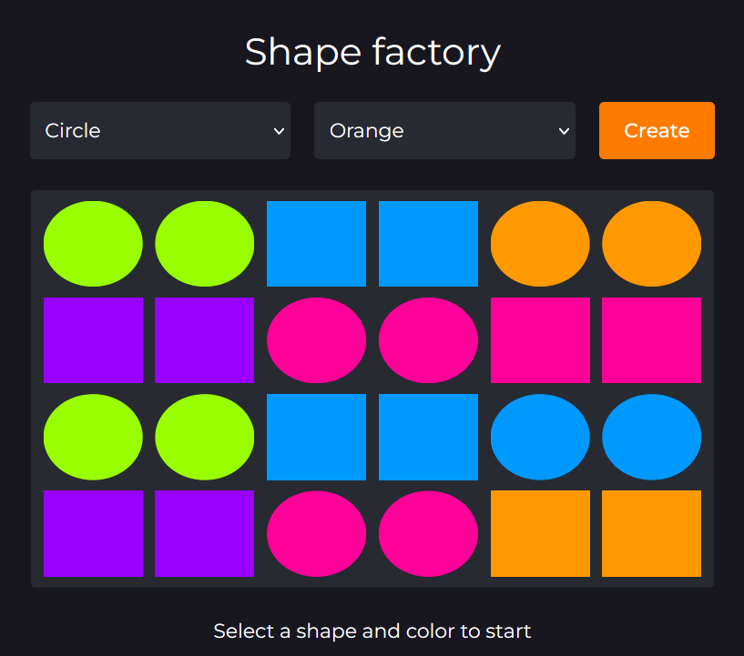

## Shape Factory

This is a fun activity where you can create shapes of different colors by clicking a button. On the button click, 
a ```div``` element is created and appended to a grid container.

### Built With
<p align='center'>
  &nbsp;
  &nbsp;
  &nbsp;
</p>

## Demo
Click [here](https://bernardoyewole.github.io/shape-factory/) to check it out.

A demo is show below:

<p align='center'>

</p>